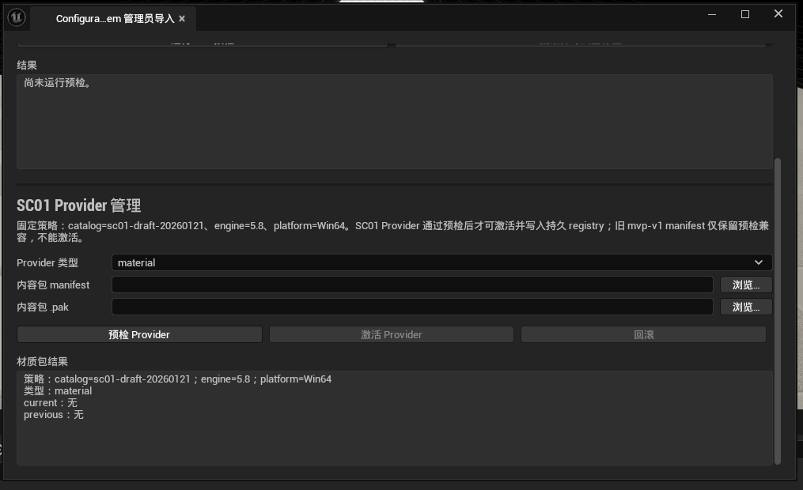

# Runtime 内容包契约与安全挂载

UE Runtime 接收 HotPatcher 或其他流水线生成的标准 `.pak`，但只依赖 UE 原生 `PakFile` 与 `FCoreDelegates::MountPak`，不链接、不调用 HotPatcher 插件 API。

每个内容包目录必须只包含配对的 manifest 与 pak：

```text
manifest.json
demo-car-materials.pak
```

manifest 结构由 `contracts/schemas/content-pack-manifest.schema.json` 冻结。v1 (`1.0.0`) 保持原契约；SC01 Provider 使用 v2 (`2.0.0`) 并增加 `providerType=material|environment|vehicle`。`pak.fileName` 必须是 manifest 同目录下的直接文件名，不接受绝对路径、父目录或别名路径。

## 预检顺序

`FContentPackMountService::PreflightAndMount` 在任何底层挂载调用前完成：

1. manifest 存在、大小不超过 1 MiB，是无未知字段的 JSON object。
2. `schemaVersion` 仅为 `1.0.0`，`packId`、`version`、`catalogVersion` 为小写 kebab-case。
3. catalog、UE engine 与目标 platform 精确匹配调用方策略。
4. `mountPoint` 位于白名单，且严格为 `<允许根>/<packId>/`；默认根是 `/Game/ContentPacks/`。
5. pak 是同目录 `.pak`，实际字节数、策略上限和 SHA-256 均与 manifest 一致。
6. 使用 UE 原生 `FPakFile` 在未挂载状态读取容器索引，将包内物理 mount point 规范化为 `/Game/...` 后与 manifest 精确比较。
7. `primaryAssetIds` 非空、格式合法、包内唯一，且不与本服务实例已经成功挂载的内容包冲突。

任一步失败都会返回错误列表，`bMounted=false`，并且不会调用 `FCoreDelegates::MountPak`。只有预检全部通过才挂载；底层挂载失败也不会登记 PrimaryAssetId。

## 调用

```cpp
FContentPackMountPolicy Policy;
Policy.CatalogVersion = TEXT("catalog-1");
Policy.EngineVersion = TEXT("5.8");

FContentPackMountService Service(MoveTemp(Policy));
const FContentPackMountResult Result =
    Service.PreflightAndMount(ManifestPath, PakPath, 0);
```

底层挂载服务不负责下载、签名信任链、热更新编排、卸载或资产注册表增量扫描。SHA-256 只保证 manifest 声明与本地文件一致，不替代发布者签名。

## SC01 Shipping Provider 管理器

`FContentPackProviderManager` 在 `FContentPackMountService` 之上提供 Shipping 激活层，策略默认固定 `catalogVersion=sc01-draft-20260121`。调用方通过 `Activate(Type, ManifestPath, PakPath)` 激活 `material`、`environment` 或 `vehicle`；v2 manifest 的 `providerType` 必须与请求类型一致。旧 v1 manifest 只允许兼容预检，不能进入 SC01 active registry。

激活顺序固定为：

1. 完成 manifest、pak、catalog、engine、platform、mount root 和 SHA-256 预检。
2. 允许同类型新版本复用稳定 PrimaryAssetId；不同类型之间仍拒绝 ID 冲突。
3. 以递增 pak order 挂载候选版本。
4. 仅扫描 manifest 声明的受限 `mountPoint`，逐个解析 `primaryAssetIds`，并确认解析路径仍位于该 mount root。
5. 将新版本作为 `current`、原 current 作为 `previous`，先写 `<registry>.tmp`，再原子替换 active registry；最后才更新内存 active。

扫描、PrimaryAsset 解析或 registry 原子替换任一步失败，都不会改变内存或磁盘 active。pak 平台不提供可靠的通用卸载事务，因此失败候选可能仍处于底层已挂载但未激活状态；后续选择始终只读取 active registry。

active registry 默认位于 `Saved/ContentPackProviders/active-registry.json`。`RestoreActiveProviders` 在重启时读取并校验 registry，重新挂载、扫描所有 current，全部成功后一次性恢复内存 active；任一失败不发布部分恢复状态。`Rollback(Type)` 重新挂载 previous 并在扫描成功后交换 current/previous，因此回滚后仍保留被替换版本，可再次切换。

```cpp
FContentPackProviderManagerPolicy Policy;
Policy.EngineVersion = TEXT("5.8");
FContentPackProviderManager Providers(MoveTemp(Policy));

const FContentPackProviderActivationResult Activated = Providers.Activate(
    EContentPackProviderType::Material,
    ManifestPath,
    PakPath);
```

Editor 管理员页可以完成真实容器预检；松散文件模式下若 `MountPak` 委托未绑定，会明确显示“底层 pak 平台文件拒绝挂载”。最终挂载门槛必须在 Cooked Development 与 Shipping 包中使用 `-ContentPackMountProbe` 验证，不能用 Editor 预检替代。

## Editor 管理员界面

打开 Unreal Editor 的 `Tools > Configuration System 管理员导入`，在“SC01 Provider 管理”区域选择 Provider 类型和配对的 manifest 与 `.pak`。该区域固定采用：

```text
catalog=sc01-draft-20260121
engine=5.8
platform=Win64
```

“激活 Provider”仅在当前选择通过 SC01 v2 预检后启用。manifest、pak 或 Provider 类型发生变化都会立即清除预检结果并禁用激活；激活时服务会重新执行完整预检、挂载、受限路径扫描和 registry 原子替换。状态区显示当前与上一版本，只有存在 `previous` 时才允许回滚。



旧 `mvp-v1` manifest 仍可用于诊断历史包，但界面会明确标记为兼容预检，禁止写入 SC01 active registry。该流程不创建、导入、移动或保存 `/Game` 下的正式资产。

## 真实 pak 命令行探针

`-ContentPackProbe` 调用 `FContentPackMountService::Preflight` 和真实 `FPakFile` 索引读取，可在无界面流程中验证历史交付 pak。该探针保留 `mvp-v1 / 5.8 / Win64` 兼容策略，只做预检，不执行 Provider 激活，也不修改资产；SC01 新包由 Provider 管理器验证和激活。

```powershell
& 'C:\Program Files\Epic Games\UE_5.8\Engine\Binaries\Win64\UnrealEditor-Cmd.exe' `
  'D:\ConfigurationSystem\source\clients\ue\ConfigurationSystem.uproject' `
  -Unattended -NullRHI -NoSplash -NoSound -ContentPackProbe `
  '-ContentPackManifest=D:\Intake\manifest.json' `
  '-ContentPackPak=D:\Intake\demo-car-materials.pak' -log
```

参数必须成对提供。预检通过时进程退出码为 `0`，失败（包括缺少参数、文件不匹配、哈希错误或 pak 索引不可读）时退出码为 `8`；详细结果写入 Unreal 日志。

## 验证

```powershell
node tools/validate-content-pack.mjs contracts/fixtures/content-pack.valid.json
node --test tools/validate-content-pack.test.mjs

& 'C:\Program Files\Epic Games\UE_5.8\Engine\Binaries\Win64\UnrealEditor-Cmd.exe' `
  'D:\ConfigurationSystem\source\clients\ue\ConfigurationSystem.uproject' `
  -Unattended -NullRHI -NoSplash -NoSound `
  '-ExecCmds=Automation RunTests ConfigurationSystem.Runtime.ContentPack;Quit' `
  '-TestExit=Automation Test Queue Empty' -log
```

Cooked 包真实挂载：

```powershell
ConfigurationSystem.exe -ContentPackMountProbe `
  -ContentPackManifest=<manifest.json> `
  -ContentPackPak=<content-pack.pak>
```

挂载成功退出码为 `0`，预检或底层挂载失败退出码为 `8`。
