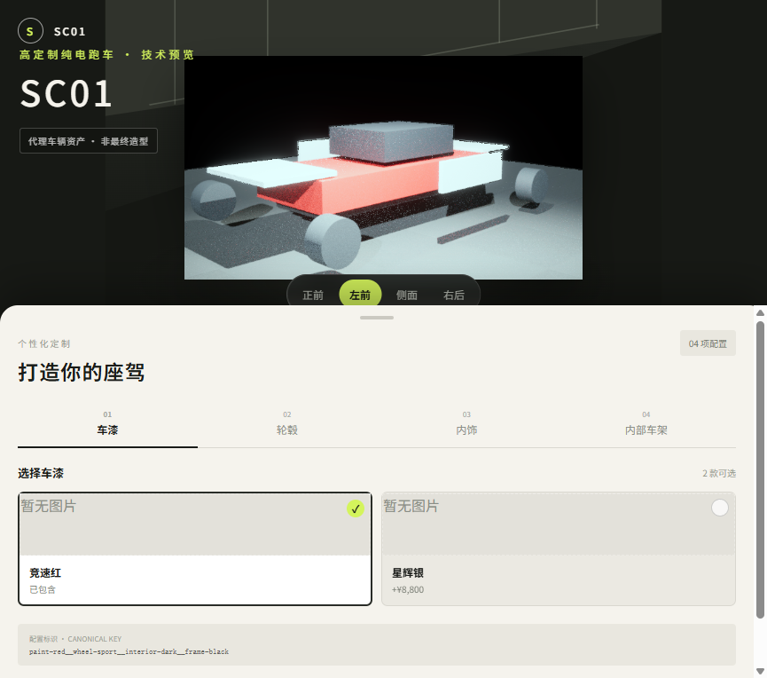

# SC01 选配资料接入记录

## 原始资料

本目录保存用户提供的两份 SC01 业务资料，原件不做修改：

- `source/SC01-定制选配清单.pdf`：4 页，来源标题为
  `All版本SC01选配清单20260121.2.xlsx`。
- `source/SC01-选配色卡.pdf`：34 页，包含材料色卡和内饰应用示意。

文件哈希、页数和使用约束见 `source-manifest.json`。

## 已确认的产品结构

选配清单不是简单的“车漆、轮毂、内饰、车架”四选一模型，而是至少包含以下层级：

| 一级区域 | 二级部件/表面 |
|---|---|
| 外观 | 全车身覆盖件、轮毂材质、轮毂造型、轮毂颜色、车辆下护板、前后卡钳、卡钳图案或涂装 |
| 方向盘 | 表皮、加粗、回中标 |
| 座椅 | 接触面、侧翼、硬件椅背板颜色、回中标 |
| 门板 | 上饰板、中饰板、扶手、扶手皮胚 |
| IP 仪表台 | 两侧翼、中翼、仪表盖、上层软包、下层软包、回中标 |
| 储物盒盖 | 软包 |
| 副仪表 | 扶手盖子、扶手盖边、手刹把 |
| 车顶 | 棚面 |
| A 柱 | A 柱表面 |
| 个性化配置 | 内饰全车黑聚落件、门槛口袋、缝线、中饰板缝线、换挡部件、刹柄、脚垫 |

材料与工艺至少包含：

- Alcantara
- Ultrasuede
- 牛皮
- 超纤
- 织物/羊毛
- 铝合金、镁合金
- 喷漆、PPG、碳纤维、不锈钢及金属件

清单中同时存在“标配”“单件价格”“左右件 `×2`”“座椅 `×2`”和用户自选比例等表达，因此价格模型必须支持数量、计价单位和条件备注，不能继续假设每个 option 只有一个固定价差。

## 色卡索引

色卡页范围：

| 页码 | 材料族 |
|---:|---|
| 1–4 | Alcantara |
| 5–7 | Ultrasuede |
| 8–14 | 牛皮 |
| 15–17 | 超纤 |
| 18–34 | 织物/羊毛 |

织物/羊毛部分可清晰确认的款式：

| 页码 | 名称 | 色卡号 |
|---:|---|---|
| 19 | SQUARES | FA8165 |
| 20 | SQUARES | FA8188 |
| 21 | SQUARES | FA8166 |
| 22 | SQUARES | FA8128 |
| 23 | PEPITA | FA8093 |
| 24 | PEPITA | FA8026 |
| 25 | PEPITA | FA8013 |
| 26 | PEPITA | FA8016 |
| 27 | SOLM | FA2729 |
| 28 | SOLM | FA2202 |
| 29 | MADRAS | FA8326 |
| 30 | TARTAN | FA8063 |
| 31 | TARTAN | FA8626 |
| 32 | TARTAN | FA8271 |
| 33 | FLANELL STREIFEN | FA3018 |
| 34 | FLANELL STREIFEN | FA3055 |

Ultrasuede 色卡中可清晰确认的命名包括 `Black UF7`、`Camel SF4`、
`Silver Pearl SF5`、`Orange SF8`、`Coffee Bean UF8`、`Bordeaux SG5`、
`Jazz Blue UF9`、`Red SG7`、`Violine UG2`、`Clove SG2`、`Burgundy 5G0`
和 `Sunshine`。正式录入前仍需逐页复核拼写和色卡号。

## 对数据契约的影响

正式 SC01 catalog 需要从当前固定四分区结构升级为：

```text
vehicle
└─ category
   └─ component
      └─ surface
         └─ material family
            └─ color / finish option
```

每个选项至少需要：

```text
optionId
displayName
categoryId
componentId
surfaceId
materialFamilyId
colorCode
finish
unitPriceMinor
quantity
pricingUnit
isStandard
constraints
notes
previewAsset
ueBinding
```

当前 `demo-car` 的 4 分区、8 选项和 16 个组合继续用于自动化测试；正式
`vehicleId=sc01` 应使用新的 catalog/schema/publication 版本，不能在
`mvp-v1` 上原位扩展。

## 色卡缩略图重建

Web 色卡位于 `source/clients/web/public/sc01/thumbnails/`，统一为
`512×512` WebP。`crop-manifest.json` 同时作为已验证的显式裁剪规格和输出
清单；每项记录源页哈希、裁剪框、输出哈希和替换状态。

```powershell
pdftoppm -png -r 144 `
  'docs\product-data\sc01\source\SC01-选配色卡.pdf' `
  '<临时目录>\sc01-color-page'

python tools\generate-sc01-thumbnails.py `
  --pages-dir '<临时目录>' `
  --crop-spec 'source\clients\web\public\sc01\crop-manifest.json' `
  --output-dir 'source\clients\web\public\sc01\thumbnails' `
  --manifest 'source\clients\web\public\sc01\crop-manifest.json' `
  --catalog 'contracts\fixtures\sc01.catalog.draft.v2.json'
```

生成器会先读取完整旧 manifest，再在全部图片成功后覆盖 manifest，因此输入和
输出可使用同一路径。源 PDF 或渲染结果变化会触发 SHA-256 失败，必须人工复核并
显式更新裁剪框，不能静默沿用旧位置。

## 待业务确认

- 清单价格是否含税、含工时，以及价格有效期。
- “用户选择百分比”字段的准确业务含义。
- 同一材料在不同部件上的可选色号范围。
- 选项之间的互斥、依赖、套餐和交付周期。
- SC01 基础车型价格及当前有效版本。
- 清单中个别低清文字和缩写的标准名称。

这些字段确认前只进入草案 catalog，不进入正式报价或订单输出。

## v2 契约原子阶段

已新增独立的 SC01 v2 草案契约，不修改 v1：

- `contracts/schemas/catalog.v2.schema.json`
- `contracts/schemas/configuration.v2.schema.json`
- `contracts/schemas/price-result.v2.schema.json`
- `contracts/fixtures/sc01.catalog.draft.v2.json`
- `contracts/fixtures/sc01.configuration.valid.v2.json`
- `contracts/fixtures/sc01.configuration.invalid.v2.json`
- `contracts/fixtures/sc01.price-result.v2.json`
- `contracts/fixtures/sc01.identity-golden.v2.json`

原子 fixture 只选取清单第 1 页可清晰复核的三个 surface，目的是冻结多层引用、
稳定配置身份和价格阻断语义，不代表完整录入。所有金额字段为 `null`，
`quoteAllowed=false`。逐字段来源见 [SOURCE_MAPPING_V2.md](SOURCE_MAPPING_V2.md)，
字段与算法决策见 [FIELD_DECISIONS_V2.md](FIELD_DECISIONS_V2.md)。

## 当前界面证据

Web 已切换为 `SC01` 技术预览，并在正式模型到位前强制显示代理资产声明：


