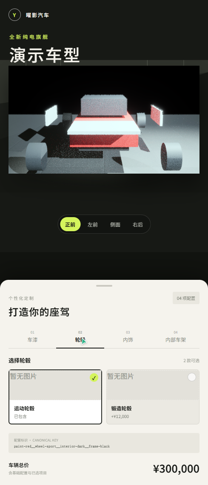
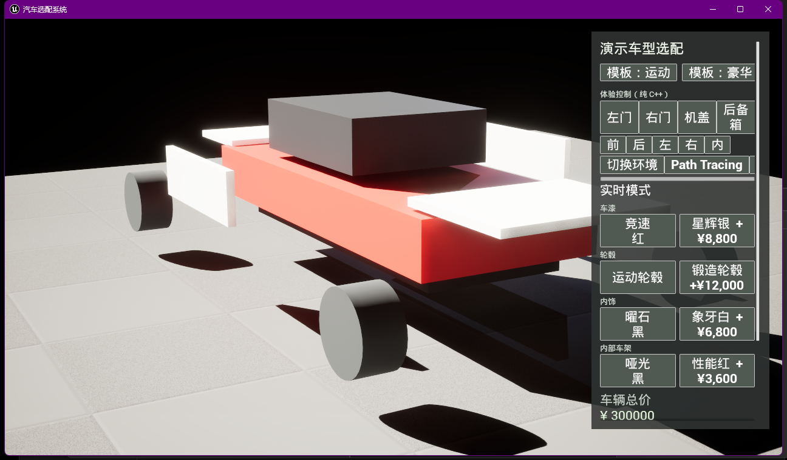

# Bake 与发布阶段验收

验收日期：2026-10-02  
代码基线：`cf4ce0f`  
发布版本：`mvp-v1`

## 验收范围

本阶段验证 UE 批量出图、不可变发布门禁、Server 资源分发、Web 图片切换，以及当前
代码基线的 Windows Shipping 打包。`mvp-v1` 使用
`Configurator.Resource.Temporary` 占位车辆，仅用于流水线与交互验收，不代表最终车辆
资产或最终产品画质。

## 当前 Bake 运行参数

发布配置不再写死为 16 个配置或 64 个任务。先从目录生成全部分区选项的笛卡尔积，
再乘以目录声明的全部 RenderView：

```powershell
node tools/generate-published-configurations.mjs `
  contracts/fixtures/catalog.mvp.json `
  contracts/fixtures/published-configurations.mvp.json `
  mvp-v1
```

生成器不会截取少量车漆或模板；任一分区无选项、目录无视角时会直接失败。UE 运行时还会
校验 `expectedRenderCount` 与实际任务数完全一致，并校验每个配置具有完整视角集合。

2K 桌面基准为 2560 × 1440：顶部 76 px、右侧配置栏 480 px、左舞台四周
18 px，因此实际可见左舞台是 **2044 × 1328（511:332）**，不是 16:9。Batch Bake
按这个实际舞台比例提供两档原始输出：

| 档位 | 分辨率 | Path Tracing SPP | 默认场景 |
| --- | ---: | ---: | --- |
| `debug` | 1022 × 664 | 64 | Editor/Development 等比半尺寸快速验证 |
| `shipping` | 2044 × 1328 | 512 | 正式 2K 左舞台原尺寸发布 |

命令行参数：

```text
-ConfigurationBakeProfile=debug|shipping
-ConfigurationBakePathTracing=true|false
-ConfigurationBakeSamples=<1..4096>
-ConfigurationBakeWidth=<640..7680>
-ConfigurationBakeHeight=<360..4320>
```

自定义宽高必须为 511:332。未显式指定档位时，Shipping 构建采用 `shipping`，其他构建采用
`debug`。Path Tracing 默认开启，同时启用 Denoiser、最高后处理抗锯齿质量和 100%
Screen Percentage；关闭后使用 Lit，并等待稳定帧再回读。PNG 回读显式执行线性到 sRGB
转换，manifest 记录渲染模式、采样数、原始宽高和 Denoiser 状态。Web 车辆图片使用
容器 `width: 100%`、`height: 100%` 与 `object-fit: contain`，不再使用 900/520 px
上限，也不裁切或二次放大填充。

### v1/v2 发布配置生成策略

- v1 使用 `--mode exhaustive`，完整枚举有限笛卡尔积。
- v2 默认只执行 `estimate`。SC01 当前完整空间为
  `391820820480000000000`（约 3.9e20）个配置，生成器明确拒绝 `exhaustive`。
- v2 `coverage` 从默认/首选基线生成去重集合，保证每个 `renderRelevant` 选项以及每个
  可被已定价色卡选项消费的 `materialVariant` 至少出现一次。当前 SC01 覆盖 154 个相关
  选项和 352 个可用材料色卡，去重后得到 469 个配置；按 4 个视角为 1876 个渲染任务，
  30 秒/张时预计 56280 秒（15.6 小时）。
- v2 `shard` 对 coverage 集合做确定性取模分片，`--shard=0/4` 到 `3/4` 合并后不重不漏。
- v2 coverage/shard 输出固定声明四个 `renderViewIds`，并对每项写出
  `configurationKey = renderKey`。`FConfigurationBakePlan::Load` 同时读取通用
  `selections/customizations`；执行时 v1 继续映射旧四分区，v2 则通过
  `UCarConfiguratorSubsystem` 取得 `UAutomotiveConfigurationState` 并调用
  `ApplyTransaction`，由状态广播驱动已绑定的材质 Binder。
- 输出及控制台同时记录完整规模、选项/材料色卡覆盖数、渲染任务数和按
  `--seconds-per-render` 计算的预计耗时。

```powershell
node tools/generate-published-configurations.mjs `
  contracts/fixtures/sc01.catalog.draft.v2.json unused.json sc01-v2 `
  --mode estimate --views 4 --seconds-per-render 30

node tools/generate-published-configurations.mjs `
  contracts/fixtures/sc01.catalog.draft.v2.json staging/sc01-coverage.json sc01-v2 `
  --mode coverage --views 4 --seconds-per-render 30

node tools/generate-published-configurations.mjs `
  contracts/fixtures/sc01.catalog.draft.v2.json staging/sc01-shard-0.json sc01-v2 `
  --mode shard --shard=0/4 --views 4 --seconds-per-render 30
```

## 自动化结果

- 2026-10-05 本分支验证：契约聚合校验、Web 67/67、Server 45/45、UE BatchBake
  6/6 通过，`ConfigurationSystemEditor Win64 Development` 编译成功。
- 使用 `-RenderOffscreen -ForceRes` 实跑 v2 `0/469` 分片，Lit Debug 模式成功输出
  1 个配置 × 4 个视角，manifest 全部为 `ready`，原图均为 1022 × 664 RGBA。
- 变基到 `b547706` 后将骨骼网格使用的 8 个材质通过 UE AssetTools 正式迁移到
  `/Game/SC01/Materials/VehicleProxy/M_SC01_Vehicle_*`。骨骼网格本体的 8 个
  `CS_Validation_*` 槽和运行时硬引用均已改写到新路径；清空被忽略的旧
  `AuthorizedAudiA5/Materials` 目录后，全新 UE 进程不再产生旧材质 LoadErrors，
  Lit Debug canary 仍可输出 4/4 `ready` PNG。
- 独立 Development Cook/Stage/Pak 成功；IoStore 清单逐项包含 8 个
  `M_SC01_Vehicle_*` 材质包，证明离线客户端不依赖编辑器缓存或被忽略目录。
- Batch 新增材质预检：可见骨骼车辆任一槽为空、使用 `DefaultMaterial` 或
  `WorldGridMaterial` 时，将全部任务写为 `failed` 且不输出 PNG；交互式 Path Tracing
  RTPSO 预热在 Batch 模式下跳过，避免 manifest 完成后的关机竞态崩溃。
- V2 Binder 目前仍只实现车漆和单一内饰代理槽。因此正式材质依赖补齐后，仍需验证
  469 套覆盖配置是否产生预期视觉差异，不能仅以 1876 个文件数量代替内容验收。
- UE Batch Bake：16 个 canonical configuration × 4 个 RenderView，共 64 个任务。
- Server：19 个测试全部通过。
- Web：18 个测试全部通过，Vite production build 成功。
- Bake manifest：64 个 `ready` RGBA PNG 全部通过尺寸、路径和 SHA-256 校验。
- HTTP 分发：64/64 PNG 可由 Server 返回。
- UE Shipping：Build/Cook/Stage/Pak/Archive 成功，AutomationTool ExitCode 为 0。

## GUI 回归

### Web

- 桌面布局验证四个视角：`front`、`front-left`、`side`、`rear-right`。
- 验证默认配置、银色车漆配置和豪华模板配置，图片 URL 均来自
  `/assets/renders/mvp-v1/<vehicle>/<canonical-key>/<view>.png`。
- 489 px 窄视口无横向溢出，展厅与选配面板按移动布局纵向排列。
- 故障注入时停止 Server，再切换到未缓存配置；选中状态立即更新，但旧图继续显示，
  没有空白闪烁。Server 恢复后重新触发选择，新图加载成功。

移动视口证据：



### UE Shipping

归档后的 `ConfigurationSystem.exe` 启动后产生可响应窗口，标题为“汽车选配系统”，
窗口尺寸为 1296 × 759。等待渲染稳定后，展厅、占位车辆、配置面板、模板、体验控制和
实时模式均可见。



## 交付位置

- UE Windows Shipping：`package/clients/ue/Windows`
- Web production build：`package/clients/web`
- 不可变 Render 发布：`package/renders/mvp-v1`
- Server 编译产物：`source/server/dist`

关键文件：

| 文件 | 字节 | SHA-256 |
| --- | ---: | --- |
| `package/clients/ue/Windows/ConfigurationSystem.exe` | 172032 | `bceb51f8f21c315ed663e62bd87e9eb75b1595534fbe5af5be9f049462ddacd5` |
| `package/clients/ue/Windows/ConfigurationSystem/Content/Paks/ConfigurationSystem-Windows.pak` | 11374123 | `ad62192a9c58557a164c7be2a10a6b6037f028c727e921d42443e1f7c1b6e38d` |
| `package/clients/web/index.html` | 456 | `23a2801c16fc0ed3e236182c7978f04252769329c98148bdf4dbfd3ef6058abb` |
| `package/renders/mvp-v1/bake-manifest.json` | 37092 | `80bbd1b64790bd37f252c443e6c0e805662251b9a3aa468573494e68de7d293e` |

64 张 PNG 合计 19,774,171 字节。

## 发布边界

- `mvp-v1` 不可覆盖；正式车辆接入后必须发布新版本目录。
- 历史 `mvp-v1` 验收图片仍是 640 × 360 的流水线证据，不代表当前默认输出参数。
- 正式发布前必须重新检查真实车辆层级、Pivot、材质槽、玻璃、穿模、动作和构图，并
  用 `shipping` 档位重新生成全部配置与视角。
- Runtime 仅接收通过 manifest、版本、路径、大小和 SHA-256 校验的标准 `.pak`。
