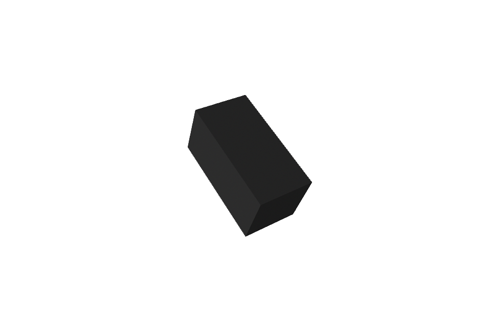

# 外部参考资产隔离与 Maya 规范化验证

状态：自动化与 Maya 2025 渲染验证通过；当前会话未获得可交互 Maya GUI 窗口。

## 范围

本阶段只验证：

- 外部 UE 样例与当前仓库的隔离边界；
- `SourceAssets` 禁止 Unreal 二进制资产的门禁；
- 已显式导出 FBX 的哈希、不可变输入和 Maya 2025 规范化；
- DCC 节点名与 UE ComponentTag 的分离。

没有读取、复制或转换 Epic Automotive Configurator 的资产正文。验证输入是 Maya 自建 Cube。

## 外部参考源

- 工程：`D:\ProjectData\UE\Project\AutomotiveConfigurator`
- 官方文档：<https://dev.epicgames.com/documentation/en-us/unreal-engine/automotive-configurator-sample-in-unreal-engine?application_version=5.8>
- Fab：<https://www.fab.com/listings/211f69e6-e091-42cd-90ba-8f3b9ffa72a1>

官方资料说明样例包含 Variant Manager、Lumen、Path Tracer、Control Rig、Sequencer 和 Movie Render Queue；Fab 页面声明仅用于 Unreal Engine 产品，并标记 `Allows usage with AI: No`。完整使用边界见 `docs/REFERENCE_ASSET_POLICY.md`。

## 实现

- `tools/validate-source-assets.mjs`
  - 递归拒绝 `.uasset`、`.umap`、`.tps`；
  - 大小写不敏感；
  - 不跟随符号链接。
- `contracts/schemas/reference-asset-normalization.schema.json`
  - 固定 Maya 2025、厘米、Z Up、二进制 FBX 2020；
  - 输入和输出只能是清单目录内的相对 FBX 路径；
  - 输入大小与 SHA-256 必填；
  - 禁止覆盖输入与已有输出。
- `tools/maya/normalize_fbx_maya2025.py`
  - 只导入清单指定 FBX；
  - 删除导入的相机和灯光；
  - 只执行显式节点重命名；
  - 冻结旋转与缩放；
  - 可选三角化；
  - 输出大小、SHA-256 和根节点摘要。

Maya/FBX 节点使用 `Vehicle_Root`、`Vehicle_Body`；UE 语义标签继续使用 `Vehicle.Root`、`Vehicle.Body`。

## 自动验证

```text
SourceAssets 门禁测试：6/6
车辆 sidecar 测试：10/10
聚合契约验证：通过，7 个 Schema
Maya 版本：2025
Maya canary：passed
输出字节数：35040
输出 SHA-256：04ba36dd2c4c73b44650c34b662b9af94b00afd011aa4b55ad5fe47a6abc8c42
输出根节点：Vehicle_Root
输出相机/灯光：0
```

## 视觉验证

Maya 2025 GUI 可执行文件在当前自动化会话中启动后退出，没有形成可交互窗口，因此不能声明交互 GUI 已通过。随后使用同一 Maya 2025 安装的 `mayaHardware2` 渲染器重新导入规范化 FBX并生成视觉证据：



图中几何保持完整；源 Cube 的 X 方向缩放已烘焙进几何，输出不依赖原对象 Scale。正式车辆仍必须在可交互 Maya 与 UE Editor 中检查层级、Pivot、材质槽、法线、UV、玻璃和穿模。
