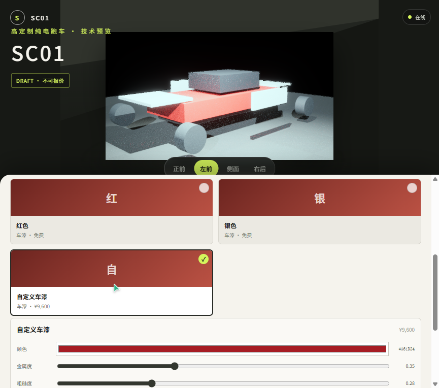
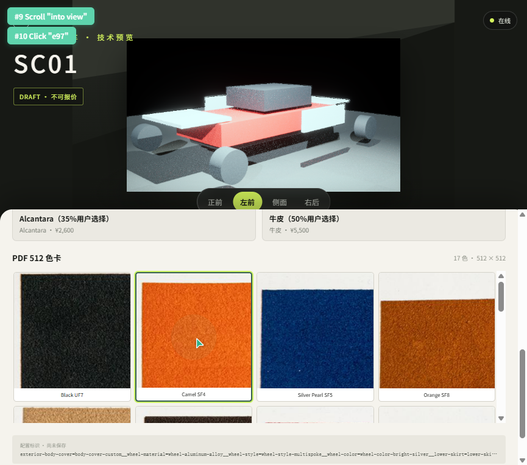

# SC01 全量目录与色卡阶段验证

状态：Web、Server、契约与浏览器 GUI 通过；正式报价仍处于 draft。

## 数据范围

- 3 个业务区域；
- 10 个类别；
- 38 个必选表面；
- 16 个材料族；
- 136 个选项；
- 352 个 PDF 色卡变体；
- 352 张 `512×512` 高质量 WebP 缩略图。

所有表面均按清单顺序进入 `selectionOrder`，任一选择变化都会改变
`configurationId`；只有显式 `renderRelevant=false` 的表面可以复用
`renderKey`。

## 车漆

- 红色：免费；
- 银色：免费；
- 自定义颜色：统一 `¥9,600`；
- 自定义参数：颜色、金属度、粗糙度、清漆层、橘皮纹、金属闪片；
- 所有参数都进入配置身份、保存恢复和渲染投影。



## PDF 色卡

色卡从原 PDF 渲染页逐页裁剪，统一输出 `512×512` WebP，并可通过
`tools/generate-sc01-thumbnails.py` 配合显式的渲染页目录与 crop spec 重建。
`source/clients/web/public/sc01/crop-manifest.json` 记录：

- 原始页、来源尺寸与来源 SHA-256；
- 裁剪坐标；
- 输出路径、字节数与 SHA-256；
- `replaceable=true`；
- `reviewRequired`。



## 验证

```text
SC01 契约：11/11
Server：30/30
Web：19/19
Web production build：通过
缩略图尺寸与哈希：352/352
UE CameraOrbit：1/1
UE Editor Development 编译：通过
```

低清或名称不确定的 176 个色卡已标记 `reviewRequired=true`，不会被当作已确认
业务数据。清单价格已录入，但基础车价、税费、工时和有效期未确认，因此正式报价
继续禁止。
