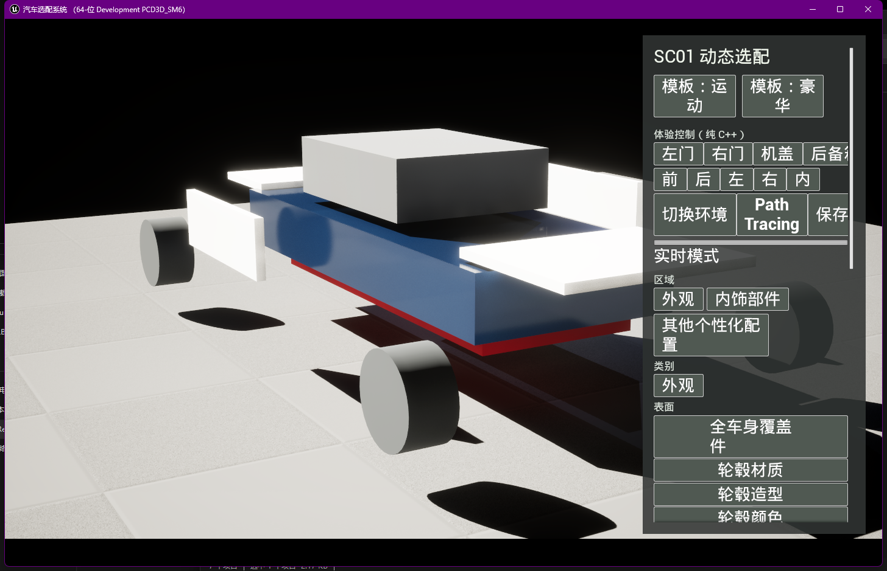
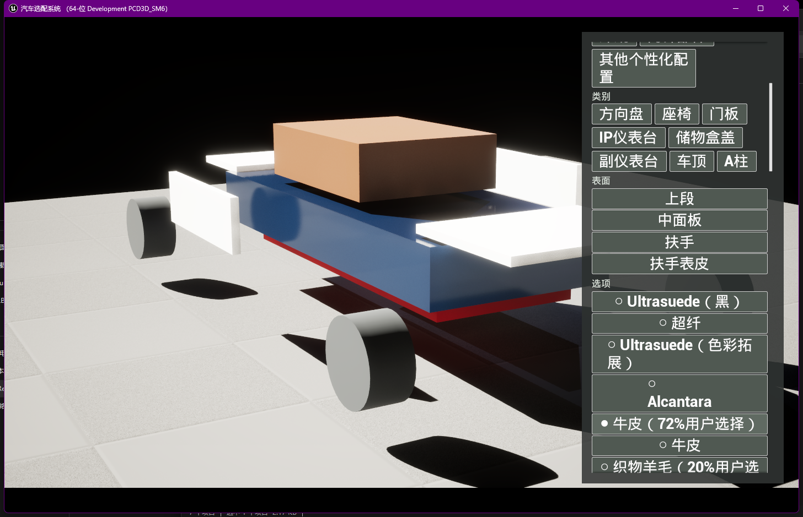
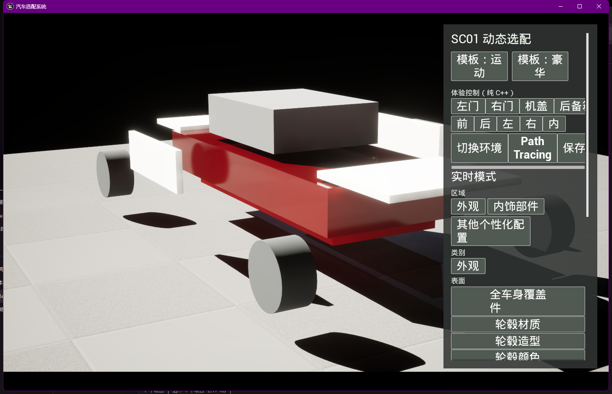

# SC01 材质体系阶段

## 结论

当前工程已从零生成六个独立 Master Material，并通过
`Sc01MaterialLibrary` Primary Asset 提供给 Runtime。实现未读取、复制或
引用 Epic Automotive Configurator 的材质、材质函数或纹理。

生成资产：

- `M_SC01_CarPaint`
- `M_SC01_Alcantara`
- `M_SC01_Ultrasuede`
- `M_SC01_Microfiber`
- `M_SC01_Leather`
- `M_SC01_WovenWool`
- `DA_SC01MaterialLibrary`

## 参数契约

车漆材质使用 Clear Coat Shading Model，并暴露：

- `BaseColor`
- `Metallic`
- `Roughness`
- `ClearCoat`
- `ClearCoatRoughness`
- `OrangePeel`
- `FlakeIntensity`

橘皮和金属闪片由两级程序 Noise 分别扰动粗糙度和底色。五类内饰材质分别
使用独立默认参数，并统一暴露：

- `BaseColor`
- `Roughness`
- `Specular`
- `MicrostructureScale`
- `MicrostructureStrength`
- `FuzzAmount`
- `FuzzExponent`

微结构由 UV、程序 Noise 和粗糙度扰动构成，绒毛响应由 Fresnel 控制。
PDF 色卡只作为颜色参考与 UI 缩略图，不作为法线、粗糙度或纤维纹理。

## 生成与打包

`FSc01MaterialAssetGenerator` 只位于 Editor 模块，并使用
`UMaterialEditingLibrary` 公开 API 创建表达式、连接 Material Property、
重编译和保存。重复运行会先删除旧表达式再重建，不累积节点。

Runtime 模块不依赖 `MaterialEditor` 或 `UnrealEd`。材质库通过 Asset
Manager 的 `AlwaysCook` 规则进入包体，运行时只加载已 Cook 材质、创建
MID 并写 uniform 参数。

## 运行时绑定

`USc01MaterialBinder` 监听 `USc01V2ConfigurationState`：

- `exterior-body-cover` 驱动
  `Configurator.Slot.paint_body`；
- `door-middle` 驱动
  `Configurator.Slot.sc01_interior_material_proxy`。

这是明确的代理映射，仅用于验证材质族切换。没有把其余 SC01 surface
伪装成已绑定。正式车辆仍必须按 surface、ComponentTag 和 material slot
逐项验收。

## GUI 证据

保存的 `#336699` 自定义车漆已在重新启动后恢复，并实际驱动车身 MID。
画面可见蓝色底色与清漆高光。

在“门板 → 中面”选择牛皮后，内饰代理舱由深色 Ultrasuede 切换为棕色
牛皮 Master Material；选中状态和画面同步变化。

上图来自本阶段 fresh Shipping 包。默认红色 Clear Coat 车漆和 v2 动态
面板在无 Editor 模块环境中正常加载。

## 验证

- `ConfigurationSystemEditor Win64 Development`：通过；
- `ConfigurationSystem Win64 Development`：通过；
- `ConfigurationSystem.Editor.SC01Materials.GenerateIdempotently`：通过；
- `ConfigurationSystem.Runtime.SC01Materials.Binder`：通过；
- 真实 Editor `-game` GUI：自定义车漆和内饰材料切换通过；
- fresh Shipping Build/Cook/Stage/Pak/Archive：通过；
- fresh Shipping GUI：材质库、默认 Clear Coat 车漆和动态面板加载通过。

## 当前边界

当前程序材质完成的是可运行的质量基线，不等同于正式 SC01 美术验收。
正式车模到位后仍需在真实 UV、曲率、尺度、灯光和 Path Tracing 条件下逐项
调校橘皮、闪片、微孔、织纹和绒毛方向，并补齐其余十个材料族。任何视觉
结论不得由代理立方体直接外推到正式车辆。
