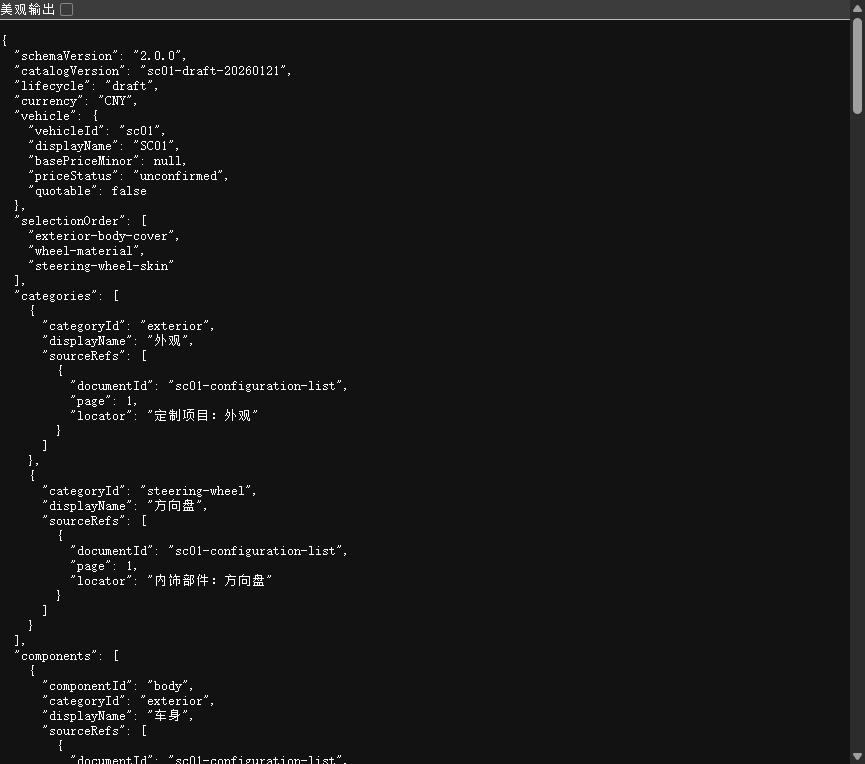

# SC01 v2 契约验证

状态：原子契约阶段通过。

## 范围

- v1 `demo-car` 的 4 分区、16 个组合和 64 图约定保持不变。
- v2 新增 `category → component → surface → materialFamily → option` 数据结构。
- SC01 当前为 draft；基础价和选项价均为 `null`，禁止报价。
- 完整 `configurationId` 与只包含 `renderRelevant` 选项的 `renderKey` 独立计算。
- 当前原子 fixture 包含 3 个表面、6 个材料族和 8 个选项；它用于冻结协议，不代表 PDF 已全部录入。

## 自动验证

```text
SC01 v2 专项测试：7/7
全部 tools 测试：26/26
Server 测试：19/19
Web 测试：18/18
聚合契约：10 个 Schema 通过
```

关键负向验证包括缺失必选面、跨 surface 选项、未知 option、伪造 ID、未知来源文档、越界页码、把未确认价格写成数值以及开放报价。

“非渲染选项改变完整配置但复用同一图片”的黄金行为已由测试覆盖，避免正式 SC01 的大量服务项和细节选项形成无界笛卡尔积。

## 浏览器验证

通过本地 HTTP 在真实浏览器加载 `sc01.catalog.draft.v2.json`，确认：

- `vehicleId=sc01`；
- `quotable=false`；
- 8 个 option 全部保持未知价格；
- 材料族和 `selectionOrder` 可被浏览器正确解析；
- 当前 8 个原子选项均显式标记 `renderRelevant=true`。



下一阶段由 Server v2 领域内核消费同一 catalog，并补齐全量表面录入、约束、数量价格和动态筛选。
