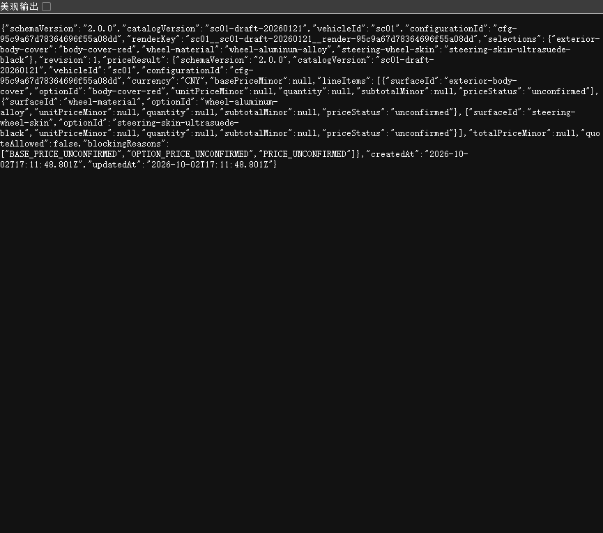

# SC01 Server v2 阶段验证

状态：通过。

## 能力

- `GET /api/v2/catalog`
- `POST /api/v2/configurations`
- `GET /api/v2/configurations/:configurationId`
- `PUT /api/v2/configurations/:configurationId`
- `Idempotency-Key` 重放和冲突检测
- `revision` 乐观并发控制
- SC01 draft 报价阻断
- 独立 `configurationId` 与 `renderKey`
- 生产入口原子 JSON 快照和重启恢复
- v1 API 保持兼容

生产入口默认把配置快照写入被 Git 忽略的
`package/server/configurations-v2.json`；测试使用可注入内存存储或临时文件。

## 验证

```text
Server：25/25
Web 回归：18/18
根工具测试：27/27
聚合契约：10 个 Schema 通过
TypeScript production build：通过
```

真实服务创建配置返回：

```text
HTTP 201
configurationId=cfg-95c9a67d78364696f55a08dd
renderKey=sc01__sc01-draft-20260121__render-95c9a67d78364696f55a08dd
revision=1
quoteAllowed=false
totalPriceMinor=null
```

浏览器随后通过配置 URL 读取同一持久化记录：



当前 `POST /api/v2/renders/resolve` 返回稳定渲染投影标识，不伪造尚未发布的
SC01 图片 URL。正式 Render publication 接入后再返回不可变图片地址。
