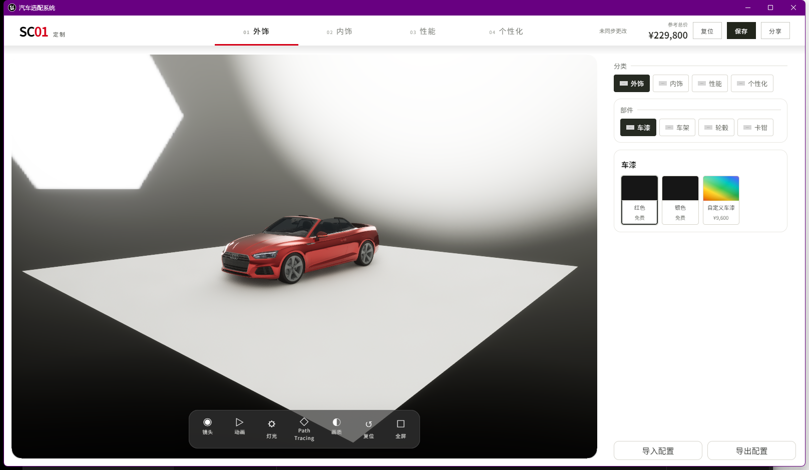

# UE 离线自包含验证

## 目标

验证 `package/clients/ue/Windows` 在不启动 ConfigurationSystem Server 的情况下，
可以从包内加载完整 React 选配 UI，并在本地生成同一份字符串选配码和二维码。

## 构建前置

- 引擎必须使用 `C:\Program Files\Epic Games\UE_5.8`。
- `D:\ProjectData\UE\UnrealEngine` 当前实际是 UE 5.7.4，不能用于本项目发布。
- 新拉取工作树先执行 `git lfs pull`，否则 `Content/SubstrateMaterials` 只是 LFS 指针。
- 先在 `source/clients/web` 执行 `npm run build`。
- Web hash 或文件集合变化后，先用 UBT `-gather` 重收 RuntimeDependencies，再执行 UAT。

## 验证结果

- Web 测试：77 项通过。
- Server 测试：45 项通过。
- Harness 与 11 个 Schema 契约通过。
- UE5.8 Build/Cook/Stage/Pak/IoStore/Archive 成功。
- NonUFS manifest 包含 481 项，其中包含 `WebUI/embedded.html` 和完整静态资源。
- CEF 远程调试发现 3 个本地页面：`header`、`controls`、`embedded`。
- 三个页面均为 `ready=complete`、`rootChildren=2`，无 Runtime exception。
- 顶部“保存”通过 UE bridge 打开配置弹窗：
  - `dialog=true`
  - 选配码前缀 `SC01CFG1.`
  - 当前默认完整配置码长度 1064
  - 二维码为 `data:image/gif;base64,`，长度 21158
- 未启动产品 Server；UE 页面 URL 均为包内 `file:///.../WebUI/embedded.html`。

## GUI 证据

画面显示顶部分类与保存/分享、右侧选配分类与车漆选项、底部体验控制条和实时车辆。

## 实现说明

在线 Web 继续使用 Vite 的 `index.html` 和哈希 JS/CSS。构建脚本从同一次产物生成
`embedded.html`，将 JS/CSS 内联并把脚本放到 `body` 尾部；UE CEF 的 `file://`
入口只加载该文件。两个部署目标仍来自同一源码和同一次构建，不存在第二套 Web。
