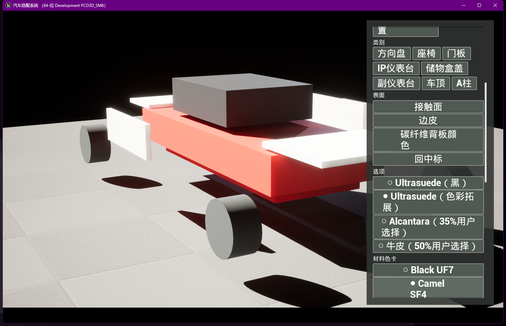
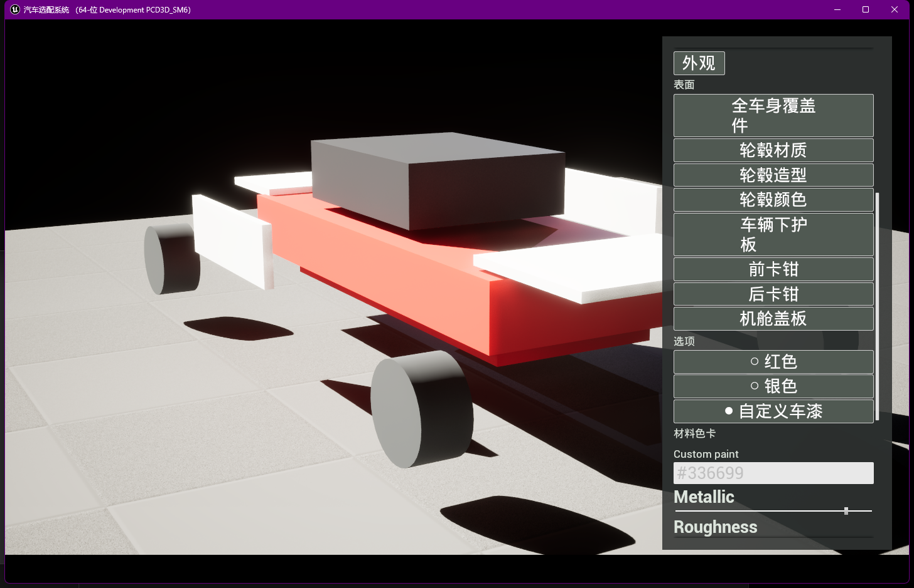

# UE SC01 v2 数据驱动阶段

## 结论

UE 客户端已从固定四分区 UI 扩展出独立的 SC01 v2 数据域，并实际消费与
Server/Web 同源的全量目录。旧 MVP 状态和 64 图回归仍保留，避免破坏已有
发布验证。

当前运行时覆盖：

- 38 个必选 surface；
- 136 个 option；
- 16 个材料族；
- 352 个 material variant；
- 自定义车漆 `#RRGGBB` 与 Metallic、Roughness、Clear Coat、
  Orange Peel、Flake Intensity；
- 与 Server 字节一致的 `configurationId` 和 `renderKey`；
- SaveGame schema v2 原子持久化与 schema v1 兼容读取。

## Primary Asset

`/Game/SC01/DA_SC01Catalog` 是 `Sc01V2Catalog` Primary Asset。共享契约
JSON 原文内嵌在资产中，Runtime 和 Shipping 不依赖仓库外部
`contracts/` 路径。`DefaultGame.ini` 对该类型使用 `AlwaysCook`。

Editor 自动化
`ConfigurationSystem.Editor.SC01V2.GenerateCatalogPrimaryAsset`
负责从共享 fixture 重建并保存资产，避免手工复制目录字段。

## 运行时状态

`USc01V2ConfigurationState` 对 selections 和 customizations 先执行全量
校验与身份派生，再一次提交并广播。无效 option、跨 surface option、
材料族不匹配的 variant、非法色值和越界车漆参数均不会污染当前状态。

Canonical 输入严格使用：

- `selectionOrder` 固定顺序；
- UTF-8；
- LF；
- 固定 customization 字段顺序；
- SHA-256 前 24 个小写十六进制字符。

共享黄金向量和带定制参数向量均与 Server 结果一致。

## 动态 UMG

面板由 Catalog 动态构建区域、类别、表面、option 和材料色卡。所有按钮使用
通用 payload 绑定，不为 136 个 option 或 352 个 variant 生成专用函数。

车漆滑杆以约 20 Hz 节流提交，鼠标释放时立即提交；播放器持久化写盘使用
350 ms 去抖。镜头、部件开合、环境、Path Tracing、手动保存与载入控制继续
保留。

真实 GUI 首轮验收发现：动态按钮回调内同步 `ClearChildren()` 会销毁当前
触发按钮，点击“内饰部件”后整个面板消失。现已改为下一帧合并刷新，并在
重新编译后按同一路径复验通过。

## GUI 证据

上图为“内饰部件 → 座椅 → 接触面 → Ultrasuede（色彩拓展）”，
`Camel SF4` 的选中标记已迁移，面板在多次动态重建后保持可用。

上图为“外观 → 全车身覆盖件 → 自定义车漆”，色值已改为 `#336699`，
Metallic 等参数控件可见并可交互。

## 验证

Editor Development 编译通过。以下自动化共 9 项通过：

- `ConfigurationSystem.Runtime.SC01V2`：4/4；
- `ConfigurationSystem.Runtime.Configurator`：1/1；
- `ConfigurationSystem.Runtime.Experience`：4/4。

Editor Primary Asset 生成测试另行通过 1/1。

## 边界

当前车辆仍是明确标记的程序化代理资产，只提供旧四槽表现。SC01 v2 的
38 surface 状态、筛选和持久化已完成，但正式的 surface-to-slot 绑定、
材料族 Shader、PDF 色卡纹理在 UE 中的可视缩略图，以及正式车辆视觉验收
属于后续材质与车辆接入阶段。Web 的 352 张 PDF 色卡图不应被误当作 PBR
材质纹理。
