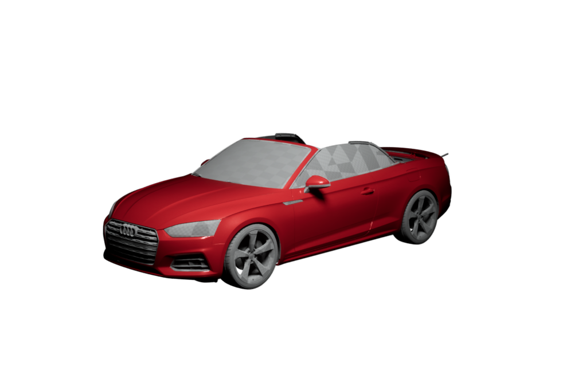

# 统一发布流水线验证

## 入口

仓库级发布统一使用：

```powershell
.\tools\release.ps1 -Target UE
.\tools\release.ps1 -Target ServerWeb
.\tools\release.ps1 -Target BakeWeb
.\tools\release.ps1 -Target All
```

目标可组合。`UE` 与 `ServerWeb` 同时出现时只构建一次 Web artifact，并分别消费
online 与 embedded 入口。

## 发布语义

- 所有目标先在最终目录同卷 staging 中构建、测试并生成 SHA-256 清单。
- 组合目标全部 prepare 成功后才统一晋升；任一晋升失败按逆序恢复旧目录。
- 正式发布默认要求干净 Git 工作树；`-AllowDirty` 仅用于本地验证。
- 发布开始冻结 HEAD；每个清单写入前复核 HEAD 和干净工作树，期间变化会中止发布。
- 失败 staging 默认保留；自动化环境可用 `-CleanFailedStaging` 清理。
- Bake 已存在的外部目录必须带 `.configuration-system-bake-output` ownership sentinel。
- Server 可变配置写入 `%LOCALAPPDATA%\ConfigurationSystem\data`，不随程序包替换。

## 真实验证

### ServerWeb

- `package/server-web` 原子生成成功。
- production 依赖安装完成，审计为 0 个漏洞。
- 不携带 renders 时 `/health` 和首页均返回 HTTP 200。
- 写入 v2 配置返回 201，快照只出现在 LocalAppData，发布目录内无运行时数据。

### UE

- 通过官方 UE5.8 执行 UBT `-gather`。
- Build/Cook/Stage/Pak/IoStore/Archive 成功。
- `BuildCookRun` 固定使用 `-prereqs` 和 AutomationTool 实际解析的
  `-applocaldirectory=<UE5.8 AppLocalDependencies>`：
  VC++ x64 CRT DLL 与程序并置，未安装全局运行库的 Windows 机器可直接启动。
- 归档同时包含 `Windows/Prerequisites/vc_redist.x64.exe` 和
  `Windows/Runtime-Prerequisites.txt`，用于系统运行库损坏或 App-local 加载异常时手动修复。
- 写入 manifest 前必须验证 `msvcp140.dll`、`vcruntime140.dll`、
  `vcruntime140_1.dll` 和 x64 安装器均存在；任一缺失则拒绝晋升发布包。
- `package/clients/ue/release-manifest.json` 覆盖归档中的逐文件 SHA-256。
- 包内 WebUI 与离线保存、分享、二维码验证见
  [UE 离线自包含验证](UE_OFFLINE_SELF_CONTAINED.md)。

### BakeWeb

真实执行：

```powershell
.\tools\release.ps1 -Target BakeWeb -Profile debug `
  -Mode shard -Shard 0/474 -Publication sc01-release-canary `
  -Output staging/release-bake-canary
```

- 生成 1 个 coverage 配置、4 个视角。
- UE Batch Bake 退出码为 0。
- Server manifest 校验为 4/4 `ready`。
- 原图均为 1022×664、sRGB、straight Alpha，并记录 SHA-256。
- 骨骼代理车的 `CS_Validation_*` 引擎回退槽已映射到现有 `M_A5_*` 项目材质；
  未知槽仍会被 Bake 预检拒绝。



该图仍是授权 Audi A5 代理车，只证明发布流水线和材质依赖完整，不代表最终 SC01 美术。
