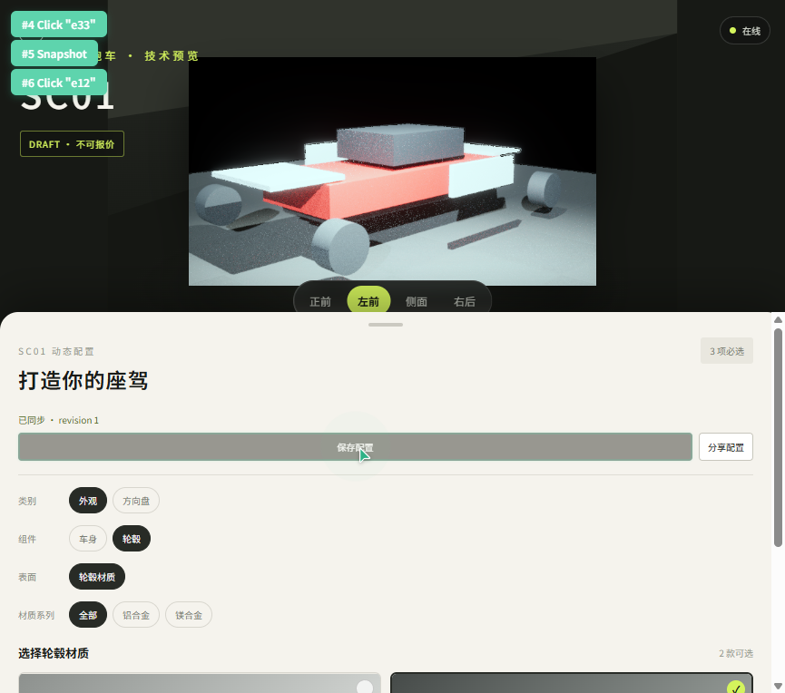

# SC01 Web v2 阶段验证

状态：通过。

## 能力

- 从 `/api/v2/catalog` 动态生成类别、组件、表面、材料族和选项。
- 支持 SC01 draft、不可报价和价格待确认状态。
- 支持保存配置、revision 更新、分享链接加载和本地草稿。
- 支持在线、离线和同步失败状态。
- `renderKey` 与视角共同决定图片请求；非渲染选项不会触发无意义换图。
- SC01 v2 图片未发布时保留 v1 代理图，并持续显示“代理车辆资产”提示。

## 验证

```text
Web 测试：16/16
Web production build：通过
Server 测试：25/25
根工具测试：27/27
```

真实浏览器在 `865×764` 响应式布局下完成：

1. 加载 SC01 v2 catalog。
2. 从“外观”切换到“轮毂”组件。
3. 材料系列显示“铝合金/镁合金”。
4. 选择“镁合金”。
5. 保存配置并显示 `已同步 · revision 1`。
6. v2 暂无图片时继续显示 v1 代理图和明确提示。



当前 catalog 仍是 3 个表面的协议原子样本。后续需要继续录入 PDF 中的全部表面与材料选项，但 UI 和 API 不再依赖固定分区数量。
